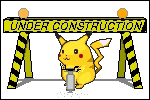

# Unbreakable emoticons

Copy-paste-ready emoticons that never break across lines.

## About

`unbreakable-emoticons` is a small collection of text emoticons made unbreakable across line wraps by using the Unicode _Word Joiner_ (WJ, `U+2060`) character between their parts.

No more half-faces on one line and the rest on the next. ☆⁠ヾ⁠(⁠*⁠´⁠・⁠∀⁠・⁠)⁠ノ⁠☆

## How to use

Visit the [GitHub page](https://leoncik.github.io/unbreakable-emoticons/) of this project, copy an emoticon, and paste it wherever you want.

## License

This project is MIT licensed.
